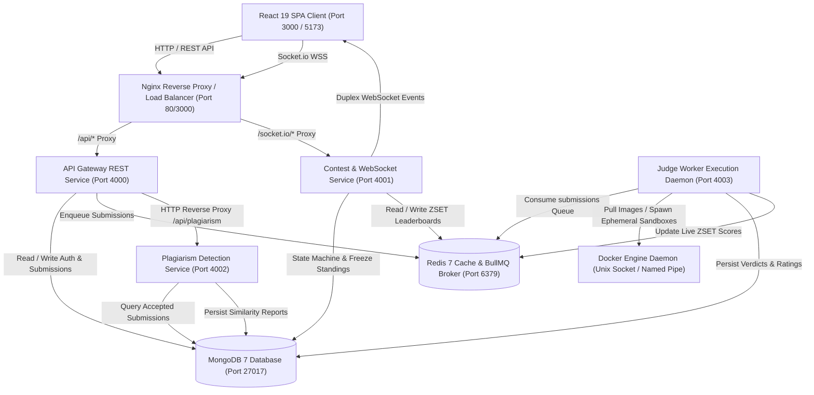
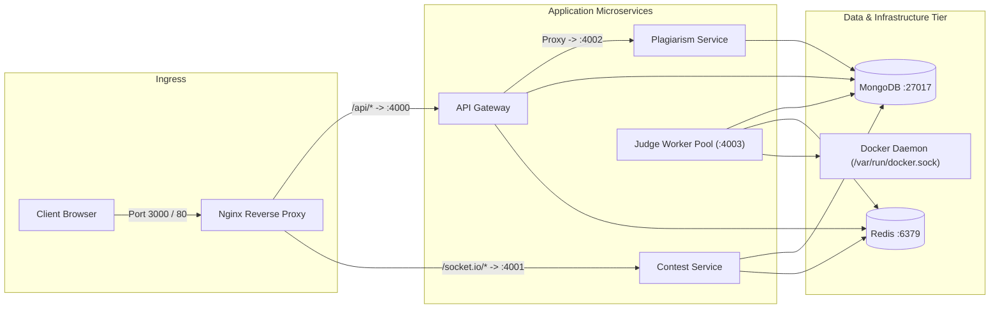
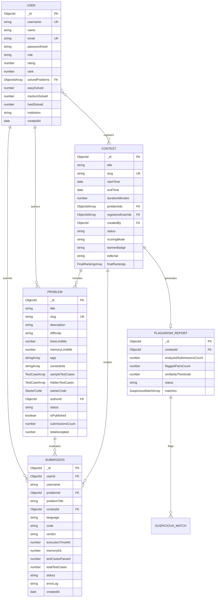
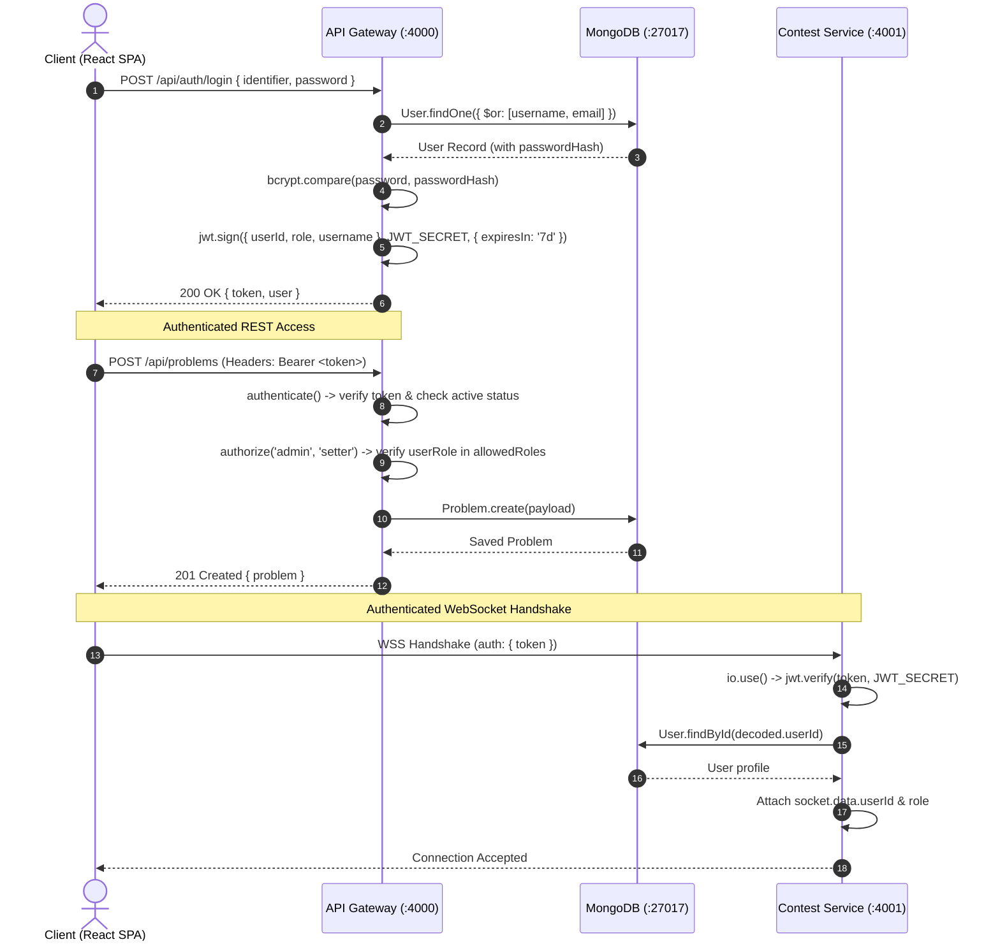
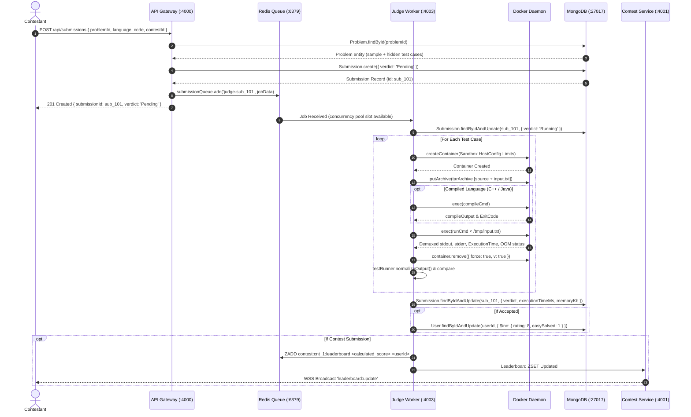
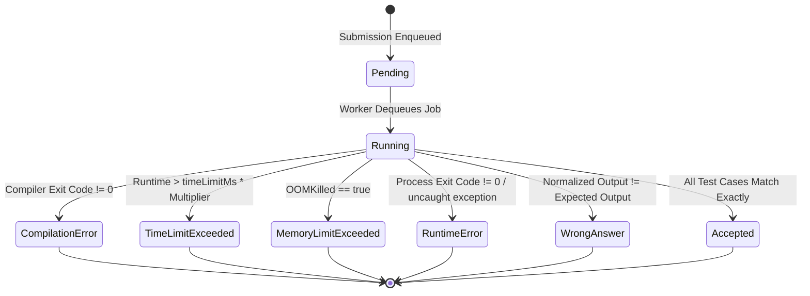
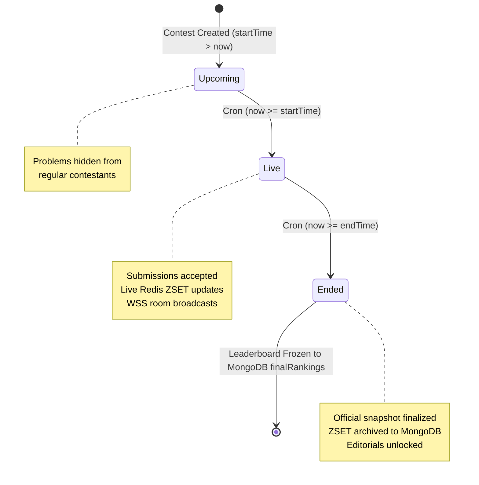
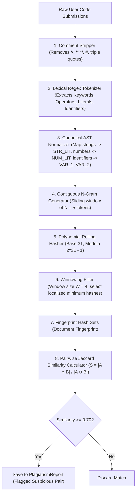
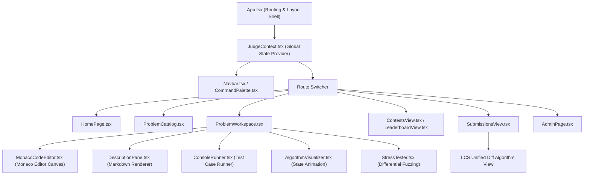

# AlgoFlow Microservices & Distributed Architecture Reference

## 1. Executive Summary & Architecture Overview

AlgoFlow is a distributed, high-throughput competitive programming platform engineered as a decoupled polyglot microservices ecosystem. The system decouples interactive client operations, background execution pipelines, live tournament standings, and structural plagiarism forensics across discrete, independently scalable services.



Asynchronous processing boundaries isolate untrusted user execution from latency-critical web transactions. While the API Gateway handles stateless user interactions, code execution requests enter a durable Redis-backed BullMQ queue for isolated sandbox evaluation by disposable Docker worker containers.

---

## 2. Microservices Topology & Service Catalogue

Every service runs in an isolated runtime boundary with dedicated configuration schemas, health check probes, and restart policies.

| Service Name | Working Directory | Runtime / Port | Protocol / Transport | Primary Responsibility | Backing Store Dependencies |
|:---|:---|:---:|:---:|:---|:---|
| **api-gateway** | `backend/api-gateway` | Node.js 20 / Port 4000 | HTTP (Express) | Auth, CRUD catalog, submission dispatch, rate limiting, admin proxy | MongoDB 7, Redis 7 (BullMQ producer) |
| **contest-service** | `backend/contest-service` | Node.js 20 / Port 4001 | HTTP + WebSocket (Socket.io) | Contest lifecycle cron, ICPC ranking, live scoreboard push | MongoDB 7, Redis 7 (Sorted Sets) |
| **judge-worker** | `backend/judge-worker` | Node.js 20 / Port 4003 | BullMQ Consumer + HTTP Health | Queue consumer, Dockerode sandbox management, test harness | MongoDB 7, Redis 7, Docker Daemon |
| **plagiarism-service** | `backend/plagiarism-service` | Node.js 20 / Port 4002 | HTTP (Express) | AST tokenization, rolling hash, Winnowing fingerprinting, similarity reports | MongoDB 7, Redis 7 |
| **frontend** | Root `/` (`src/`) | Vite / Nginx / Port 3000 / 5173 | HTTP (Static assets) | SPA client, Monaco editor, live scoreboard, visualizer, stress tester | `api-gateway`, `contest-service` |
| **mongodb** | Docker Container | MongoDB 7 / Port 27017 | Wire Protocol | Master persistent database for all entities and audit logs | Persistent Volume `mongodb_data` |
| **redis** | Docker Container | Redis 7 / Port 6379 | RESP3 | BullMQ job queue, token rate limiter store, sorted set standings | Persistent Volume `redis_data` |



Service lifecycles adhere to 12-factor principles. Health probes monitor database connection readiness, Redis buffer accessibility, and Docker socket availability across every endpoint at `/health` and `/api/health`.

---

## 3. Database Architecture & Data Models

Primary application state resides in MongoDB under database `algoflow`. Ephemeral state, distributed locks, queue manifests, and real-time tournament standings reside in Redis.



### 3.1 MongoDB Collection Schemas & Indexing Matrix

| Collection Name | Key Field Types | Unique Constraints | Secondary & Compound Indexes | Query Optimization Purpose |
|:---|:---|:---|:---|:---|
| **users** | `_id`: ObjectId<br>`username`: String<br>`email`: String<br>`role`: String<br>`rating`: Number | `username: 1`<br>`email: 1` | `{ rating: -1 }`<br>`{ username: 1 }`<br>`{ email: 1 }` | Fast authentication lookups and global leaderboard rating sorts |
| **problems** | `_id`: ObjectId<br>`slug`: String<br>`difficulty`: String<br>`tags`: Array<br>`status`: String | `slug: 1` | `{ difficulty: 1 }`<br>`{ tags: 1 }`<br>`{ difficulty: 1, tags: 1 }`<br>`{ status: 1, createdAt: -1 }`<br>`{ isPublished: 1, createdAt: -1 }` | Catalog multi-facet filtering by difficulty, topic tags, and published status |
| **submissions** | `_id`: ObjectId<br>`userId`: ObjectId<br>`problemId`: ObjectId<br>`contestId`: ObjectId<br>`verdict`: String | None | `{ userId: 1, createdAt: -1 }`<br>`{ problemId: 1, verdict: 1 }`<br>`{ contestId: 1, verdict: 1 }`<br>`{ createdAt: -1 }` | User history feeds, problem acceptance aggregations, and contest solution extractions |
| **contests** | `_id`: ObjectId<br>`slug`: String<br>`startTime`: Date<br>`endTime`: Date<br>`status`: String | `slug: 1` | `{ status: 1, startTime: 1 }`<br>`{ startTime: 1, endTime: 1 }` | Cron lifecycle transitions and upcoming tournament schedule queries |
| **plagiarismreports** | `_id`: ObjectId<br>`contestId`: ObjectId<br>`status`: String | None | `{ contestId: 1 }` | Instant lookup of stored contest anti-cheat forensic reports |

### 3.2 Redis Key Schema & Data Structures

| Key Pattern | Redis Type | Producer Service | Consumer Service | TTL / Eviction Policy | Data Payload / Structure |
|:---|:---|:---|:---|:---|:---|
| `bull:submissions:*` | Hash, Stream, ZSet | `api-gateway` | `judge-worker` | Completed: 3600s (Max 1000)<br>Failed: Max 500 | BullMQ job metadata, test payloads, execution arguments |
| `contest:<id>:leaderboard` | Sorted Set (ZSET) | `judge-worker` / `contest-service` | `contest-service` | Persistent during contest; frozen to Mongo on end | Member: `userId`<br>Score: `(solvedCount * 1_000_000) - penaltyMinutes` |

---

## 4. Authentication, Authorization & Security Architecture

AlgoFlow implements stateless JSON Web Token (JWT) authentication combined with granular Role-Based Access Control (RBAC).



### 4.1 Role-Based Access Control Matrix

| System Resource / Action | Method & Endpoint | `user` | `setter` | `admin` | Unauthenticated / Guest |
|:---|:---|:---:|:---:|:---:|:---:|
| **Register & Login** | `POST /api/auth/*` | Allowed | Allowed | Allowed | Allowed |
| **View Published Problems** | `GET /api/problems` | Allowed | Allowed | Allowed | Allowed |
| **Inspect Hidden Test Cases** | `GET /api/problems/:id` | Redacted | Allowed | Allowed | Redacted |
| **Create / Edit Problems** | `POST, PUT /api/problems/*` | Denied (403) | Allowed | Allowed | Denied (401) |
| **Delete Problem** | `DELETE /api/problems/:id` | Denied (403) | Denied (403) | Allowed | Denied (401) |
| **Submit Solution** | `POST /api/submissions` | Allowed | Allowed | Allowed | Denied (401) |
| **Create Contest Round** | `POST /api/contests` | Denied (403) | Allowed | Allowed | Denied (401) |
| **Trigger Plagiarism Scan** | `POST /api/plagiarism/scan` | Denied (403) | Allowed | Allowed | Denied (401) |
| **System Stats & User Role Edit**| `GET, PATCH /api/admin/*` | Denied (403) | Denied (403) | Allowed | Denied (401) |
| **Emit WebSocket Scoring** | Socket `score:*` | Denied | Allowed | Allowed | Denied |

---

## 5. Asynchronous Submission & Sandboxed Execution Pipeline

The execution engine runs untrusted user code inside isolated Docker micro-containers with non-negotiable memory, CPU, PID, and networking constraints.



### 5.1 Docker Sandbox Hardening Specifications

The parameters below are extracted verbatim from `backend/judge-worker/src/sandbox/DockerSandbox.ts`:

```typescript
HostConfig: {
  Memory: memoryBytes,              // User limit in bytes (e.g. 256MB = 268435456)
  MemorySwap: memoryBytes,          // Equal to Memory -> Completely disables swap overcommit
  CpuPeriod: 100000,                // 100ms CFS scheduling period
  CpuQuota: 50000,                  // 50ms quota -> Strict 50% single-core throttle
  PidsLimit: 50,                    // Strict process limit -> Defeats fork bombs
  SecurityOpt: ['no-new-privileges'], // Blocks SUID escalation and setuid/setgid binaries
  Tmpfs: {
    '/tmp': 'rw,nosuid,size=64m',  // RAM-backed scratch space, non-executable, auto-wiped
  },
}
```



### 5.2 Language Toolchain Matrix

| Language Identifier | Runtime / Compiler Image | Source Filename | Compilation Command | Execution Command | Timeout Multiplier |
|:---|:---|:---|:---|:---|:---:|
| `cpp` | `gcc:13` | `solution.cpp` | `g++ -O3 -std=c++20 /tmp/solution.cpp -o /tmp/solution` | `/tmp/solution` | `1.0x` |
| `python` | `python:3.12-alpine` | `solution.py` | *Interpreted* | `python3 /tmp/solution.py` | `1.5x` |
| `java` | `openjdk:21-alpine` | `Solution.java` | `javac /tmp/Solution.java` | `java -XX:+UseSerialGC -Xmx256m -cp /tmp Solution` | `2.0x` |
| `javascript` | `node:20-alpine` | `solution.js` | *Interpreted* | `node --max-old-space-size=256 /tmp/solution.js` | `1.2x` |

---

## 6. Contest Engine, Real-Time Leaderboards & ICPC Scoring

The Contest Service orchestrates real-time tournament operations, autonomous cron state management, and high-speed ranking via Redis Sorted Sets.



### 6.1 ICPC Mathematical Score Encoding

To achieve $O(\log N)$ inserts and instant rank retrieval without iterating over participant lists, user scores are converted into a composite scalar score stored inside a Redis Sorted Set (`ZSET`):

$$\text{Redis ZSET Score} = (\text{problemsSolved} \times 1{,}000{,}000) - \text{totalPenaltyMinutes}$$

$$\text{Problem Penalty} = \text{submissionMinuteOffset} + (\text{rejectedAttempts} \times 20)$$

```typescript
// Solved count dominates the high-order bits; lower penalty yields higher score
const rankScore = solvedCount * 1000000 - penaltyMinutes;
await redisClient.zadd(`contest:${contestId}:leaderboard`, rankScore, userId);
```

```mermaid
sequenceDiagram
    autonumber
    actor Participant as Contestant
    participant Worker as Judge Worker (:4003)
    participant Redis as Redis Sorted Set (:6379)
    participant CS as Contest Service (:4001)
    actor Spectator as Spectators (Contest Room)

    Participant->>Worker: Solves Problem (Verdict: Accepted)
    Worker->>Worker: Compute solvedCount & penaltyMinutes
    Worker->>Redis: ZADD contest:cnt_99:leaderboard 2999840 user_42
    Worker->>Redis: ZREVRANK contest:cnt_99:leaderboard user_42
    Redis-->>Worker: Rank: 0 (1st Place)
    Worker->>CS: leaderboardService.updateScore(contestId, userId, solved, penalty)
    CS->>CS: emitToContest('cnt_99', 'leaderboard:update', payload)
    CS-->>Spectator: WSS Event 'leaderboard:update' (Scoreboard Updates Instantly)
```

---

## 7. AST Tokenization & Algorithmic Plagiarism Detection Engine

The Plagiarism Detection Service implements a structural tokenization, rolling polynomial hash, and Winnowing fingerprinting pipeline to uncover structural code similarity regardless of variable renaming or comment modifications.



### 7.1 Pipeline Mathematical & Algorithmic Constants

- **Polynomial Rolling Hash Formula**:
  $$H(S) = \left( \sum_{i=0}^{k-1} S[i] \times 31^{k-1-i} \right) \pmod{2^{31} - 1}$$
- **Gram Size ($N$)**: $5$ tokens per n-gram.
- **Winnowing Window ($W$)**: $4$ hashes per window.
- **Guarantee Threshold**: Any shared token sequence of length $L \ge (W + N - 1) = (4 + 5 - 1) = 8$ tokens is guaranteed to be detected.
- **Jaccard Similarity Formula**:
  $$J(A, B) = \frac{|A \cap B|}{|A \cup B|}$$
- **Default Flagging Threshold**: $0.70$ ($70\%$ token fingerprint overlap).

---

## 8. Unified API & WebSocket Event Reference

### 8.1 REST API Route Directory

| Service | Method | Route Path | Access Level | Description & Request Parameters |
|:---|:---|:---|:---|:---|
| **Gateway** | `POST` | `/api/auth/register` | Public | Register user account `{ username, email, password, name?, institution? }` |
| **Gateway** | `POST` | `/api/auth/login` | Public | Authenticate user `{ identifier, password }` |
| **Gateway** | `GET` | `/api/auth/me` | Bearer Token | Fetch authenticated user profile and solved problems |
| **Gateway** | `PUT` | `/api/auth/profile` | Bearer Token | Update user profile `{ name?, institution?, avatarUrl? }` |
| **Gateway** | `GET` | `/api/problems` | Public | Paginated problem list `{ page?, limit?, search?, difficulty?, tag? }` |
| **Gateway** | `GET` | `/api/problems/:id` | Public / Staff | Get problem details (hides `hiddenTestCases` unless Admin/Setter) |
| **Gateway** | `POST` | `/api/problems` | Admin, Setter | Create problem `{ title, description, difficulty, timeLimitMs, sampleTestCases, ... }` |
| **Gateway** | `PUT` | `/api/problems/:id` | Admin, Setter | Update problem attributes |
| **Gateway** | `DELETE`| `/api/problems/:id` | Admin Only | Remove problem from catalog |
| **Gateway** | `POST` | `/api/submissions` | Bearer Token | Submit code `{ problemId, language, code, contestId? }` (Rate limited: 10/min) |
| **Gateway** | `GET` | `/api/submissions` | Public / Token | List filtered submissions `{ problemId?, userId?, contestId?, verdict? }` |
| **Gateway** | `GET` | `/api/submissions/:id` | Public | Poll submission status and execution telemetry |
| **Gateway** | `POST` | `/api/contests` | Admin, Setter | Create contest round `{ title, startTime, endTime, durationMinutes, problemIds }` |
| **Gateway** | `POST` | `/api/contests/:id/register` | Bearer Token | Register user for contest |
| **Gateway** | `GET` | `/api/contests/:id/leaderboard` | Public | Fetch computed standings from MongoDB/Redis |
| **Gateway** | `PUT` | `/api/contests/:id/editorial` | Admin, Setter | Update contest editorial markdown |
| **Gateway** | `GET` | `/api/admin/stats` | Admin, Setter | Platform-wide user, problem, and submission counts |
| **Gateway** | `GET` | `/api/admin/users` | Admin, Setter | Paginated user management table |
| **Gateway** | `PATCH`| `/api/admin/users/:id/role`| Admin Only | Change user role `{ role: 'user' \| 'setter' \| 'admin' }` |
| **Gateway** | `GET` | `/api/admin/health` | Admin, Setter | Deep queue inspection (`llen` of wait/active/failed) |
| **Contest** | `GET` | `/contests` | Public | List all contests |
| **Contest** | `GET` | `/contests/:id/leaderboard` | Public | Direct query for Redis ZSET standings |
| **Contest** | `GET` | `/contests/:id/my-rank` | Bearer Token | Fetch user's current live standing and penalty |
| **Plagiarism**| `POST` | `/scan` or `/contest/:id/analyze`| Admin, Setter | Trigger full contest pairwise AST plagiarism scan |
| **Plagiarism**| `GET` | `/scan/:contestId` | Admin, Setter | Retrieve stored plagiarism analysis report |
| **Plagiarism**| `POST` | `/submission/:id/check` | Admin, Setter | Check single submission against peer solutions |

### 8.2 WebSocket Event Catalogue (`contest-service` :4001)

| Event Name | Direction | Socket Room | Payload Definition | Purpose |
|:---|:---:|:---|:---|:---|
| `join:contest` | Client $\rightarrow$ Server | Global | `contestId: string` | Joins client socket to `contest:<contestId>` room |
| `leave:contest` | Client $\rightarrow$ Server | Global | `contestId: string` | Leaves `contest:<contestId>` room |
| `joined:contest`| Server $\rightarrow$ Client | Direct Socket | `{ contestId, room }` | Confirms room subscription |
| `leaderboard:update` | Server $\rightarrow$ Client | `contest:<id>` | `{ contestId, userId, username, score, solvedCount, penaltyMinutes, rank, timestamp }` | Pushes real-time rank changes when a solution passes |
| `contest:started` | Server $\rightarrow$ Client | `contest:<id>` | `{ contestId, title, startTime, endTime, status: 'live' }` | Notifies users that contest has officially opened |
| `contest:ended` | Server $\rightarrow$ Client | `contest:<id>` | `{ contestId, title, status: 'ended', topRankings }` | Pushes final tournament conclusion signal |
| `notification:contest_started` | Server $\rightarrow$ Client | Global Broadcast | `{ contestId, title, message }` | Platform-wide toast notification |
| `notification:contest_ended` | Server $\rightarrow$ Client | Global Broadcast | `{ contestId, title, message }` | Platform-wide conclusion toast notification |

---

## 9. Frontend Architecture & Interactive Workspace Modules

The client is built with React 19, TypeScript, TailwindCSS, Monaco Editor, and Lucide icons.



### 9.1 Specialized Workspace Engines

1. **Monaco Code Editor**: Multi-tab code editor supporting C++, Python, Java, and JavaScript with local storage draft persistence per problem and user.
2. **Algorithm Visualizer**: In-browser step execution engine animating 5 common algorithmic paradigms:
   - Two Pointers (e.g. Two Sum, Container With Most Water)
   - Sliding Window (e.g. Longest Substring Without Repeating Characters)
   - Binary Search (e.g. Search in Rotated Sorted Array)
   - Stack & Queue (e.g. Valid Parentheses, Monotonic Stack)
   - Array Traversal & In-Place Swapping
3. **Stress Tester**: Differential testing harness running user solutions against randomized test cases alongside a brute-force solver to discover edge-case failures.
4. **Submissions Diff Engine**: Longest Common Subsequence (LCS) unified diff generator highlighting revisions between consecutive submission attempts.

---

## 10. Deployment, Orchestration & Configuration Guide

### 10.1 Environment Variables Configuration

| Variable Name | Required By | Default Value / Example | Description |
|:---|:---|:---|:---|
| `PORT` | `api-gateway`, `contest-service`, `plagiarism-service` | `4000`, `4001`, `4002` | HTTP listen port |
| `NODE_ENV` | All Backend Services | `development` / `production` | Node environment flag |
| `MONGO_URI` | All Backend Services | `mongodb://mongodb:27017/algoflow` | MongoDB connection string |
| `REDIS_URL` | All Backend Services | `redis://redis:6379` | Redis broker connection URI |
| `JWT_SECRET` | `api-gateway`, `contest-service` | `algoflow_jwt_secret_dev_key_2026` | Symmetric key for JWT signature |
| `JWT_EXPIRES_IN` | `api-gateway` | `7d` | JWT expiration duration |
| `CORS_ORIGIN` | `api-gateway`, `contest-service`, `plagiarism-service` | `http://localhost:5173` | Allowed CORS origins |
| `MAX_CONCURRENT_JOBS` | `judge-worker` | `3` | Maximum concurrent sandbox jobs per worker instance |
| `DOCKER_SOCKET` | `judge-worker` | `/var/run/docker.sock` | Docker daemon UNIX socket or Windows pipe |
| `VITE_API_URL` | `frontend` | `http://localhost:4000/api` | API Gateway base URL for frontend |
| `VITE_CONTEST_URL` | `frontend` | `http://localhost:4001` | Contest WebSocket base URL for frontend |

### 10.2 Production Orchestration (Docker Compose)

Deploy the entire stack with isolated networking and health-checked service dependencies:

```bash
docker compose up -d --build
```

To seed the initial problem catalog, editorial tests, and administrator credentials (`admin`/`Admin@123`):

```bash
docker compose exec api-gateway npm run seed
```

### 10.3 Native Windows Orchestration (`start.ps1`)

Local development environments without full Docker composition utilize PowerShell process orchestration:

```powershell
# Starts MongoDB, Memurai/Redis, API Gateway, Contest Service, Judge Worker, Plagiarism Service, and React Frontend
.\start.ps1

# Clean shutdown of all running AlgoFlow process trees
.\stop.ps1
```
